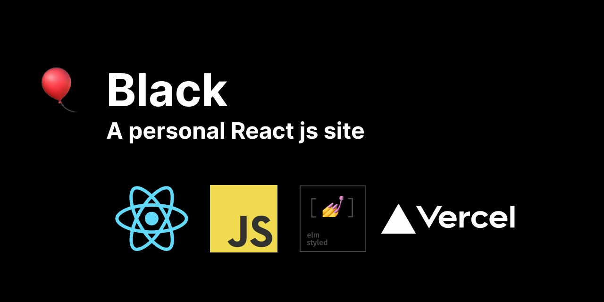
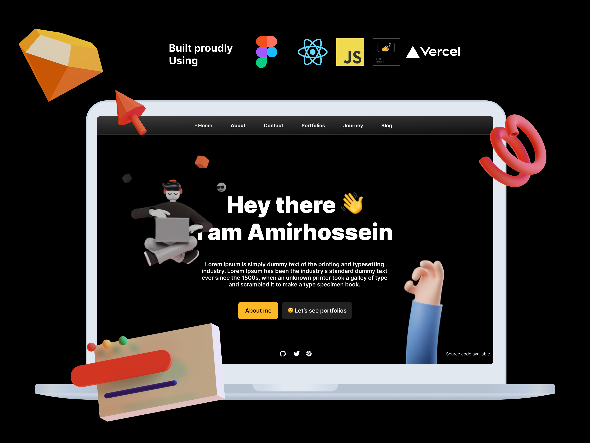

<p></p>

# Black
Black is a personal site created using react, javascript, styled-components, and deployed on vercel.

# Design


<p><p>


You can find Dribbble post for this design in [here] (https://dribbble.com/shots/15250284-Personal-site?utm_source=Clipboard_Shot&utm_campaign=amireshoon&utm_content=Personal%20site&utm_medium=Social_Share) and also it's open and you can find resources or contribute in design by [this link](#).

# Installation
First clone repo and run
```
npm install
```
Then start the development server by
```
yarn start
```
Now the app is available on localhost:3000

# Contribute
I'm not a Front-end developer and this project is a kinda time-filling project for me. So this project has many flaws and if you think you could fix them, totally feel free to send me pull requests.
